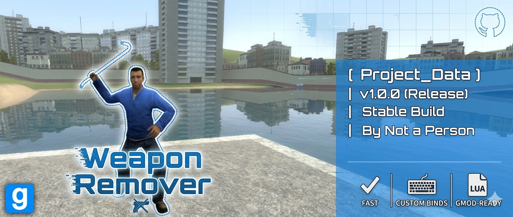

# Weapon Remover v1.0

[English description below](#english) | [Описание на русском](#russian)

---

  

## 🇺🇸 English

A simple and effective tool for quickly stripping active weapons or clearing your entire inventory in Garry's Mod using customizable key combinations.

### 🚀 Features
* **Active Weapon Removal:** Instantly remove the weapon currently in your hands.
* **Full Clear:** Button to quickly wipe your entire arsenal.
* **Custom Binds:** Assign any keys (including mouse buttons) via a user-friendly menu.
* **Spawn Block:** Option to automatically strip weapons when a player spawns.
* **Localization:** Full support for English and Russian languages.
* **HUD Hint:** On-screen display of current binds (can be toggled).

### ⌨️ Usage
Default keys: **E + Right Mouse Button**.
To customize: **Q Menu -> Options -> Weapon Remover -> Settings**.

---

## 🇷🇺 Russian

Простой и эффективный инструмент для быстрого удаления активного оружия или полной очистки инвентаря в Garry's Mod с помощью настраиваемых комбинаций клавиш.

### 🚀 Функции
* **Удаление активного оружия:** Моментально удаляет то, что у вас в руках.
* **Полная очистка:** Кнопка для быстрого удаления всего арсенала.
* **Настраиваемые бинды:** Назначайте любые клавиши (включая мышь) через удобное меню.
* **Блокировка спавна:** Опция автоматического удаления оружия при появлении игрока.
* **Мультиязычность:** Полная поддержка русского и английского языков.
* **HUD Подсказка:** Отображение текущих клавиш на экране (можно отключить).

### ⌨️ Использование
Клавиши по умолчанию: **E + Правая кнопка мыши**.
Настройка: **Q Menu -> Настройки -> Weapon Remover -> Настройки**.

---

## 🛠 Installation / Установка

1. Download `weapon_remover.lua`.
2. Place it in: `garrysmod/lua/autorun/weapon_remover.lua`
3. Restart the game or change the map.

---

## 👥 Credits / Команда

* **Author:** [Not a Person](https://github.com/thechumersh/)
* **Beta Testers:** Daniel64FX

---

## 📄 License

This project is licensed under the MIT License.
